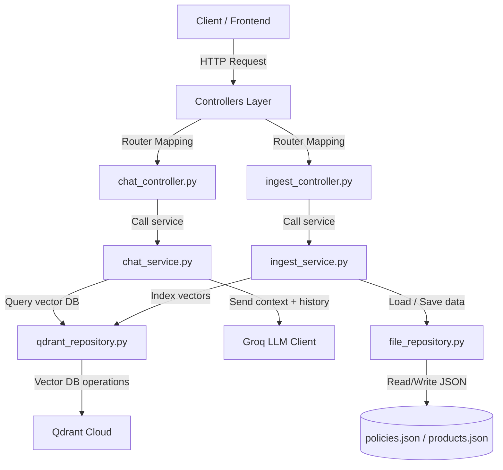

# Playmobil Chat Service & RAG Pipeline

A modular, lightweight, high-performance RAG (Retrieval-Augmented Generation) chat service using **FastAPI**, **Groq (Llama-3.3-70b)**, and **Qdrant Cloud**. 

The service implements a virtual play consultant named **Maya** to answer questions about shop policies, products, and make personalized recommendations following a specific persona.

---

## Architecture

This project is built using a clean, layered architecture to decouple API request handling, business logic, and data storage operations:



### Architectural Layers

1. **Controllers (`controllers/`)**: Manages endpoint routing, incoming request validation via Pydantic models, and high-level exception handling.
2. **Services (`services/`)**: Orchestrates business logic, formats prompt instructions, interfaces with LLM clients, and maps repository data.
3. **Repositories (`repositories/`)**: Handles data storage integrations, isolating database interactions (Qdrant Vector DB) and file system interactions (`policies.json`/`products.json`).
4. **Models (`models.py`)**: Defines standard schemas and validation types.
5. **Dependencies (`dependencies.py`)**: Declares singletons and manages dependency injection across the services and controllers.

---

## Project Structure

```text
├── controllers/
│   ├── chat_controller.py      # /chat endpoint router
│   └── ingest_controller.py    # /products & /ingest endpoint routers
├── services/
│   ├── chat_service.py         # Maya persona logic, Groq LLM integration, & similarity search
│   └── ingest_service.py       # Ingestion orchestration
├── repositories/
│   ├── file_repository.py      # Reads/writes local JSON (products and policies)
│   └── qdrant_repository.py    # Interfaces with remote Qdrant Vector Database
├── dependencies.py             # Instantiates & injects repository and service dependencies
├── models.py                   # Pydantic schema declarations
├── ingest.py                   # Standalone ingestion CLI script
├── policies.json               # Seed files for shop policies
├── products.json               # Auto-generated/synchronized product storage
├── main.py                     # App entrypoint & CORS middleware setup
├── requirements.txt            # Python dependencies
└── .env                        # Local configuration and API credentials
```

---

## Getting Started

### 1. Environment Setup

Create a `.env` file in the root directory:

```env
# Groq API Key
GROQ_API_KEY=your_groq_api_key_here

# Store Customization
STORE_NAME="Playmobil Toy Shop"
STORE_DESCRIPTION="A premium online store selling high-quality Playmobil toys."

# Qdrant Vector DB Credentials
QDRANT_URL=https://your-qdrant-instance.cloud.qdrant.io
QDRANT_API_KEY=your_qdrant_api_key_here
```

### 2. Installation

Set up a virtual environment and install dependencies:

```bash
python3 -m venv .venv
source .venv/bin/activate
pip install -r requirements.txt
```

### 3. Data Ingestion

To populate your Qdrant vector database, you can choose to run the standalone ingestion script:

```bash
python ingest.py
```
> [!NOTE]
> The standalone script ensures the Qdrant collection exists and appends documents without dropping the collection, making it safe for progressive updates.

---

## API Endpoints

Start the FastAPI application server:
```bash
uvicorn main:app --reload
```
The server runs by default at `http://127.0.0.1:8000`.

### 1. `POST /chat`
Generates a response using the Playmobil assistant (Maya) after performing similarity retrieval over policies and products context.

* **Payload:**
  ```json
  {
    "message": "Do you have any outdoor adventure sets?",
    "history": [
      {
        "role": "user",
        "content": "Hello!"
      },
      {
        "role": "assistant",
        "content": "Hi there! I am Maya, your play consultant. How can I help you today?"
      }
    ]
  }
  ```
* **Response:**
  ```json
  {
    "reply": "..."
  }
  ```

### 2. `POST /products`
Overwrites the local `products.json` file with a list of products. Typically triggered when syncing product catalogs from external inventory systems.

* **Payload:**
  ```json
  [
    {
      "id": "prod_001",
      "text": "Playmobil City Life School Bus at $24.99 - Features a yellow school bus with working lights, a driver figure, and school children."
    }
  ]
  ```
* **Response:**
  ```json
  {
    "status": "success",
    "message": "products.json file updated successfully."
  }
  ```

### 3. `POST /ingest`
Triggers full vector database re-indexing. Unlike the CLI script, this endpoint performs a clean state reset by dropping the existing collection and rebuilding it from `policies.json` and `products.json`.

* **Payload:** None
* **Response:**
  ```json
  {
    "status": "success",
    "message": "Successfully ingested 6 items (5 policies, 1 products)."
  }
  ```

---

## Testing with `curl`

Once the server is running, you can test it directly:

**Sync Products:**
```bash
curl -X POST "http://127.0.0.1:8000/products" \
     -H "Content-Type: application/json" \
     -d '[{"id": "camping_set", "text": "Playmobil Camping Adventure Carry Case at $11.24 - Features camper figures, a campfire, and a canoe."}]'
```

**Re-index Database:**
```bash
curl -X POST "http://127.0.0.1:8000/ingest"
```

**Send Chat Message:**
```bash
curl -X POST "http://127.0.0.1:8000/chat" \
     -H "Content-Type: application/json" \
     -d '{"message": "What is your policy on returning opened playmobil sets?", "history": []}'
```

